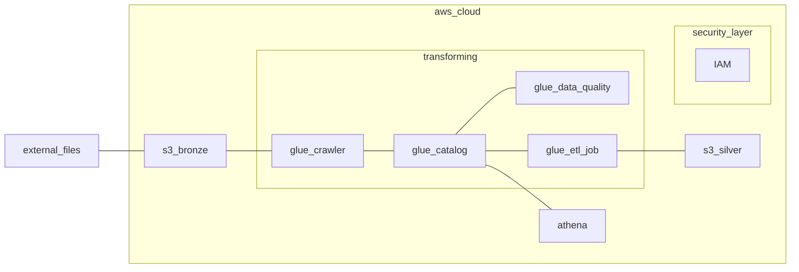

# Analytics Engineering on AWS

>WORK IN PROGRESS...

<br/>

## Target
The main focus is on creating ETL with AWS Glue, starting from data ingestion with S3 bucket to transforming data into organized tables for queries in AWS Athena and generating dataviz in AWS QuickSight

- Uploading data to S3 buckets
- Creation of bronze (raw data) and silver (transformed data) layers
- Database and table configuration in AWS Glue Data Catalog
- Building ETL pipelines with AWS Glue Studio
- Performing ad-hoc queries with AWS Athena


<br>

## Architecture



```External Files``` represents raw data </br>
```Security Layer``` "IAM" service to create an auxiliary user that will insert Data into the Lake </br>
```Bucket S3 -> Bronze layer``` to store raw data </br>

```Glue Crawler``` extract informations from ```Bucket S3``` and creation of table W/ ```Glue Data Catalog``` </br>
```Glue Data Catalog``` storing table informations </br>
```Glue Data Quality``` quality of informations </br>
```Athena``` data query </br>
```Glue ETL job``` ETL creation and information processing </br>
```Bucket S3 -> Silver layer``` to store processed data </br>


<br>
