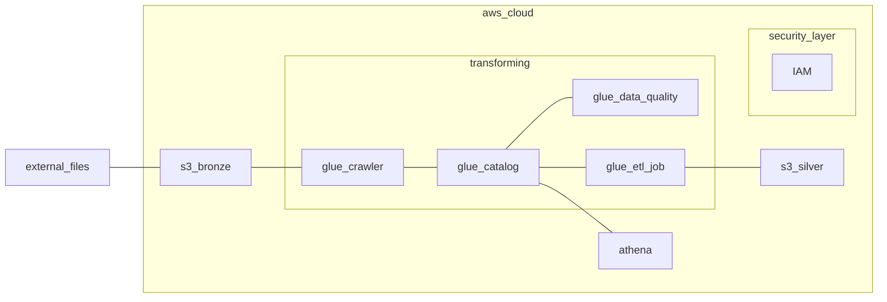

# Analytics Engineering on AWS

>WORK IN PROGRESS...

 

## Target
The main focus is on creating ETL with AWS Glue, starting from data ingestion with S3 bucket to transforming data into organized tables for queries in AWS Athena and generating dataviz in AWS QuickSight

- Uploading data to S3 buckets
- Creation of bronze (raw data) and silver (transformed data) layers
- Database and table configuration in AWS Glue Data Catalog
- Building ETL pipelines with AWS Glue Studio
- Performing ad-hoc queries with AWS Athena

 

## Architecture

- **Camada Bronze:** Armazena os dados brutos, como foram recebidos
  - `vendas_zoop_bronze.parquet`
  - `estoques_zoop_bronze.parquet`
  - `redes_sociais_zoop_bronze.parquet`

- **Camada Silver:** Contém os dados tratados conforme as requisições passadas pelo Head de Dados.

 
